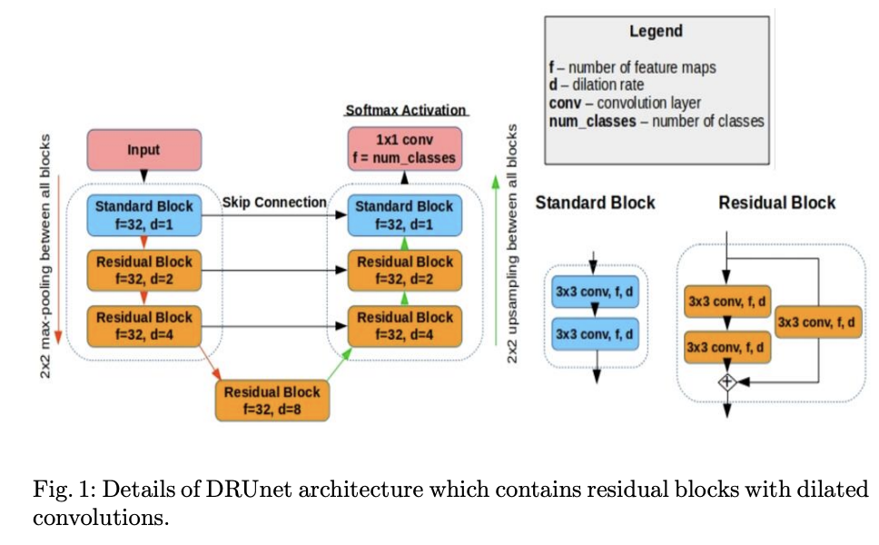
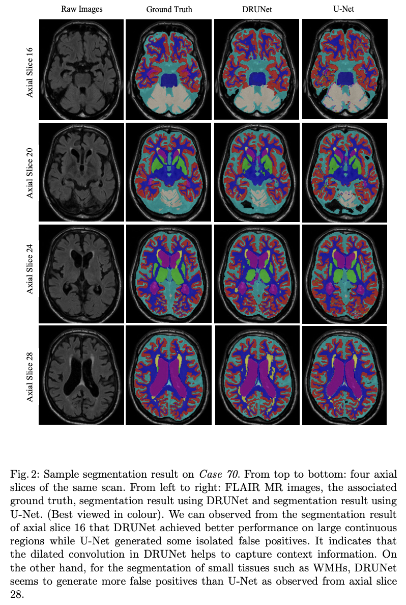

# Deep Residual Dilated U-Net (DRU-Net) for Brain Structure Segmentation


Implementation of **"Automatic Brain Structures Segmentation Using Deep Residual Dilated U-Net"** (Li, Zhygallo, Menze), presented at [MICCAI BrainLes 2018](https://doi.org/10.1007/978-3-030-11723-8_39).

This project performs multi-class segmentation of brain MRI scans (FLAIR, T1, IR modalities) into 8 anatomical structures using a U-Net variant enhanced with **residual connections** and **dilated convolutions** to capture multi-scale spatial context without increasing parameter count.

## Architecture

<p align="center">
  
</p>
<p align="center"><em>Fig. 1: DRU-Net architecture with residual blocks and dilated convolutions. Standard blocks use two 3x3 convolutions; residual blocks add a skip (identity) path. Dilation rates increase with depth (d=1, 2, 4, 8) to expand the receptive field.</em></p>

## Results

<p align="center">
  
</p>
<p align="center"><em>Fig. 2: Visual comparison of segmentation results across axial slices. From left to right: raw MRI input, ground truth, DRU-Net prediction, and baseline U-Net prediction.</em></p>

**Quantitative comparison (MRBrainS13 challenge):**

| Metric | DRU-Net | U-Net |
|---|---|---|
| Dice Similarity Coefficient | **80.9%** | 78.3% |
| 95th-percentile Hausdorff Distance | **4.35 mm** | 11.59 mm |

## Project Structure

```
.
├── run_train.py              # Training entry point (CLI)
├── run_test.py               # Testing & evaluation entry point (CLI)
├── data_gen.py               # 3D-to-2D patch extraction from NIfTI volumes
├── evaluation.py             # Dice, Hausdorff, Volume Similarity metrics
├── metrics.py                # Keras loss functions (weighted cross-entropy, Dice)
├── models/
│   ├── DRUNet.py             # DRU-Net (40 initial filters)
│   ├── DRUNet32f.py          # DRU-Net (32 initial filters)
│   ├── DRUNet32fLD.py        # DRU-Net (32 filters, lower dilation)
│   └── UNet.py               # Baseline U-Net
├── tools/
│   ├── augmentation.py       # Data augmentation (rotation, shear, zoom)
│   ├── generate_masks.py     # Generate segmentation masks using a trained model
│   ├── load_weights.py       # Transfer weights between model variants
│   ├── test.py               # Evaluate a single predicted mask against ground truth
│   ├── test_fusion.py        # Multi-label fusion evaluation
│   └── visualization.py      # Training history visualization
└── requirements.txt
```

## Requirements

```bash
pip install -r requirements.txt
```

See [requirements.txt](requirements.txt) for the full list of dependencies.

## Usage

### 1. Prepare Data

Extract 2D slices from 3D NIfTI brain MRI volumes:

```bash
python data_gen.py /path/to/data \
    --test_img "070" \
    --flair True --t1 True --ir True \
    --output_fold /path/to/output
```

Input folder structure:
```
data/
├── images/
│   ├── FLAIR/   # *_FLAIR.nii files
│   ├── T1/      # *_T1.nii files
│   └── IR/      # *_IR.nii files
└── masks/       # *_mask.nii files
```

### 2. Train

```bash
python run_train.py train/images.npy train/masks.npy weights.h5 \
    --pretrained_model pretrained.h5 \
    --use_augmentation True \
    --test_imgs_np_file test/images.npy \
    --test_masks_np_file test/masks.npy \
    --output_test_eval eval_results.json
```

### 3. Evaluate

```bash
python run_test.py test/images.npy test/masks.npy weights.h5 \
    --output_metric_file metrics.json
```

### 4. Generate Masks

```bash
python tools/generate_masks.py /path/to/images /path/to/output weights.h5 \
    --flair --t1 --num_classes 9
```

## Citation

```bibtex
@inproceedings{li2018automatic,
  title={Automatic Brain Structures Segmentation Using Deep Residual Dilated U-Net},
  author={Li, Hongwei and Zhygallo, Andrii and Menze, Bjoern},
  booktitle={Brainlesion: Glioma, Multiple Sclerosis, Stroke and Traumatic Brain Injuries (BrainLes 2018)},
  series={Lecture Notes in Computer Science},
  volume={11383},
  pages={385--393},
  year={2019},
  publisher={Springer},
  doi={10.1007/978-3-030-11723-8_39}
}
```

## Acknowledgments

- [MICCAI MRBrainS13 Challenge](https://mrbrains13.isi.uu.nl/) for providing the brain MRI segmentation benchmark
- Co-authors: Hongwei Li and Bjoern Menze (Technical University of Munich)
- Evaluation code adapted from the [MRBrainS13 evaluation framework](https://mrbrains13.isi.uu.nl/)
